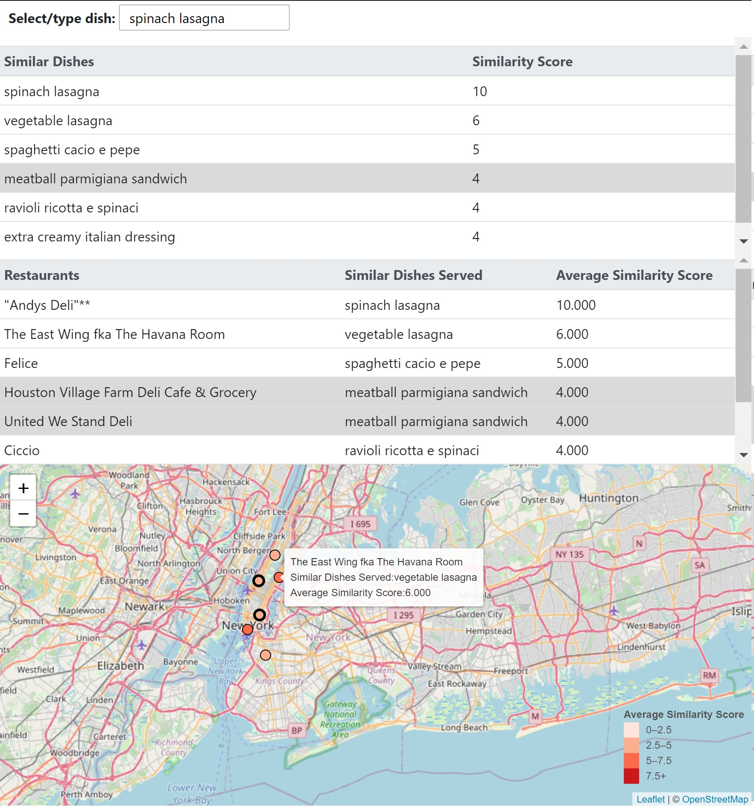

# dva-final-project

# 1. [Nana] Scraping Menu Data

We scraped the menus of the top 500 most popular restaurants in NYC according to https://www.allmenus.com/ny/new-york/-/.
The scraper code can be run from `scrape_menu_dishes.py`.

The list of restaurants is stored under `menu_data/restaurant_list.tsv`. Each row consists of:
- Restuarant Name
- Relative URL of Restaurant
- Restaurant's cuisine
- Restaurant address

The dishes served at each restaurant is stored under `menu_data/restaurant_dish_list.tsv`. Each row consists of:
- Relative URL of Restaurant (can be used to link back to restaurant in `menu_data/restaurant_list.tsv`)
- Name of dish
- Dish description (if available)
- Dish price

# 2. [Nana] Getting Recipe Data

We used the [Edamam Recipe Search API](https://developer.edamam.com/edamam-recipe-api).
The free developer account comes with 10K API calls a limit, max 10 calls per minute.

Hitting the API requires you to sign up for an account, which will get you an application key and application id.

The `scrape_recipes.py` script gets unique list of dish names stored in `menu_data/restaurant_dish_list.tsv` and runs each dish against Edamam's Recipe Search API.
The JSON output of each search is stored under `recipe_search_data` directory, where the search results of searching each dish is stored in a separate file. 

In this sense, each restaurant dish should correspond 1:1 to a JSON file in the `recipe_search_data` directory.

The **current issue** with the code is that when the **dish name** is not "clean" and contains junk words, the recipe API does not return any results.
For this reason, Nana has not finished running the code through all the current scraped dish names.

Below are examples of dish names that need cleaning up as they currently return 0 recipe results:
- "08. virginia ham" -> remove the "08" 
- "03. vegetarian omelette peppers&comma; onions&comma; tomatoes and cheese" -> remove "03. and &comma and ;"
- "sardegna sandwich platte" -> might return more recipe results of "platter" was removed
- "awesome caramel pretzel rod" -> perhaps remove "awesome" for the dish name to get more recipe results
- "hail caesar salad" -> there could be more results if we removed "hail"
- "(boar's head meat) philly cheese steak" -> There would probably be results stored if we got rid of "(boar's head meat)" in the search query

To get more ideas of how we could clean up dish names, refer to the log file in `recipes/log_1st_edaman_recipe_search_api_run.txt`.

# 3. [Swaraj Patankar] Match dishes from menu data to recipes

Nana's suggestions for the next steps are below:

- Sign up for your own account on Edaman and get your own application key and application id so we are not rate limited by just 1 account. Just remember to modify these values in `scrape_recipes.py` `__init__`. 
- **Clean up dish names**: See notes above. Add an additional preprocessing step to the `write_recipes_for_all_dishes()` function in `scrape_recipes.py`. Then run the preprocessed dish names through the `write_recipe(dish_name)` function.
- Make sure as we are re-running the recipe search, we also append to a text file where each row contains `restaurant_url`, `original_dish_name`, `matched_recipe`. This will make it easier to go between restaurant dish names -> recipes.
    - We could store the recipe results in a new `recipe` directory, with 1 recipe per file. 

# 4. [David Howell and Nicholas Davis] Creating Ingredient Vectors

We took the matched restaurant dish and recipe data and converted it into vector representations of ingredients that can be used to calculate recipe similarity. The code for ingredient vector creation can be found in `find_similar_dishes.py`
- For each list of ingredients (recipe), we cleaned the individual ingredient strings, stemmed each word, and then concatenated the cleaned ingredients into one long ingredient string. This was achieved through the function `clean_ingredients()`
- We then converted these ingredient strings into vector representations by using TF-IDF in the function `create_ingredient_vectors()`
- The vector representations form a sparse matrix of shape **number of ingredients X number of unique ingredients across all recipes**

# 5. [David Howell] Finding Most Similar Dishes

We took the sparse ingredient matrix and found the most similar dishes to each recipe by using two methods: cosine similarity and kmeans clustering. We then compared the results of the two methods to determine which recommended the most similar dishes. The code can be found in `find_similar_dishes.py`

After comparison, we found that the cosine similarity algorithm produced better recommendations. This code can be found in the `compare_algorithms()` function.

The final output to be used for the visualization is a pair of csv files:

The list of restaurants and the dishes they serve is `restaurants_df.csv`. Each row consists of:
- The URL of the restaurant
- The dish name

The list dishes and their similar recommended dishes is `recipes_df.csv`. Each row consists of:
- The dish name
- The indexes in `restaurants_df.csv` that feature the dish
- The names of the Top 5 recommended dishes
- The indexes in `restaurants_df.csv` that feature the top 5 recommended dishes
- The similarity scores for each of the recommended dishes on a 1-10 scale

For visualization, the indexes of the recommended dishes from `recipes_df.csv` are mapped back to the restaurants in `restaurants_df.csv` to locate them on a map.

# 6. [Ilkay] Service and visualization

Visualization can be launched by running a python server from viz folder (python -m http.server 8888) and typing http://localhost:8888/index.html in the browser.
Visualization will depend on 2 other files viz/d3_data.csv and viz/restaurant_location/updated_restaurant_list.tsv.

Snapshot of preliminary visualization with real data is shown below. Typing/selection in dish drop-down is propogated to similar dishes and restaurants lists and the restaurants are marked on the map.

TODO: Click events beyond highlights in the lists and map, styling improvements.
